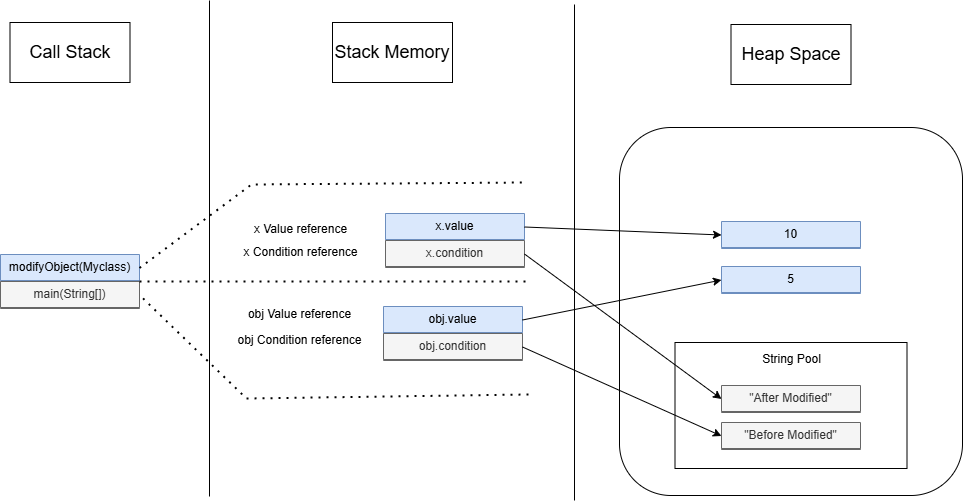
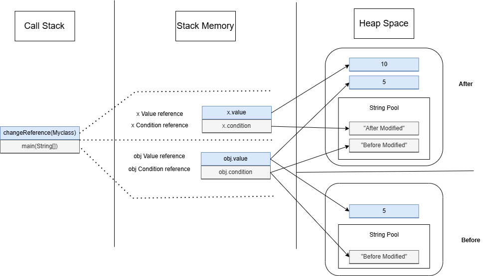

# Passing Reference Types

### First Algorithm

```java
class Myclass {
    int value;
    String condition;
}

public class assignment6a {
    public static void modifyObject(Myclass x) {
        x.value = 10;
        x.condition = "After Modify";
        // x = new Myclass();
        // x.value = 10;
    }

    public static void main(String[] args) {
        Myclass obj = new Myclass();
        obj.value = 5;
        obj.condition = "Before Modify";

        System.out.println(obj.value);
        System.out.println(obj.condition);
        modifyObject(obj);

        System.out.println("obj value after modification: " + obj.value);
        System.out.println("obj value after modification: " + obj.condition);

    }
}

```

## Memory Analysis

### Inisial State

When Myclass obj = new Myclass(); is executed, the following happens:

- _Heap Memory:_ A new instance of Myclass is created.
- _Stack Memory:_ The reference obj is stored, pointing to the object in the heap.

### Call State

- When 'main' is called, it is pushed onto the call stack.
- The reference 'obj' is created and initialized.
- When 'modifyObject(obj)' is called, it is pushed onto the call stack with the reference 'x' pointing to the same object as 'obj'.

### ModifyObject Method Execution

- 'x.value = 10'; changes the value field of the object pointed to by 'x' (and 'obj' since they refer to the same object) to 10.
- 'x.condition = "After Modify";' changes the condition field of the same object to "After Modify".

### After ModifyObject Method Execution

- The method 'modifyObject' returns, and it is popped off the call stack.
- The changes made to the object via 'x' are reflected in 'obj' since they refer to the same object in the heap.
  <br>

_Here is the illustration about the Call Stack, Stack Memory, and Heap Space in this code._

<br>
<br>

### Second Algorithm

```java
class Myclass {
    int value;
    String condition;
}

public class assignment6b {
    public static void changeReference(Myclass x) {
        x = new Myclass();
        x.value = 10;
        x.condition = "After Modify";
    }

    public static void main(String[] args) {
        Myclass obj = new Myclass();
        obj.value = 5;
        obj.condition = "Before Modify";

        System.out.println(obj.value);
        System.out.println(obj.condition);
        changeReference(obj);

        System.out.println("obj value after modification: " + obj.value);
        System.out.println("obj value after modification: " + obj.condition);

    }
}

```

## Memory Analysis

### Initial State

- _Heap Memory:_ A new instance of 'Myclass' is created for 'obj'.
- _Stack Memory:_ The reference 'obj' is created in the stack, pointing to the object in the heap.

### Call Stack

- When 'main' is called, it is pushed onto the call stack.
- The reference 'obj' is created and initialized.
- When 'changeReference(obj)' is called, it is pushed onto the call stack with the reference 'x' pointing to the same object as 'obj'.

### During changeReference Execution

- 'x = new Myclass();' creates a new instance of Myclass and assigns it to 'x'. Now 'x' points to a new object, but 'obj' still points to the original object.
- 'x.value = 10;' and 'x.condition = "After Modify";' modify the new object, not the original object.

_Here is the illustration about the Call Stack, Stack Memory, and Heap Space in this code._

